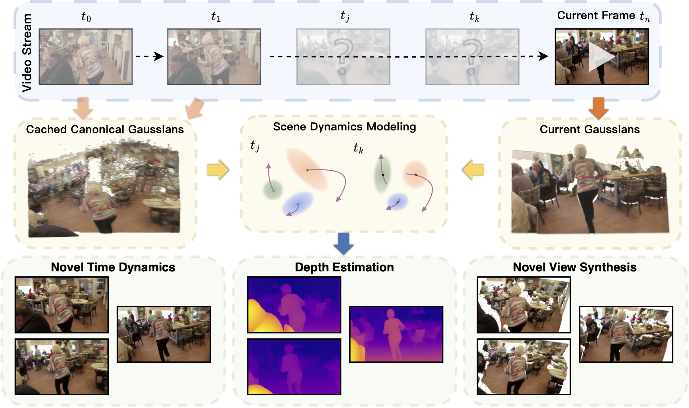

# StreamSplat: Towards Online Dynamic 3D Reconstruction from Uncalibrated Video Streams

<a href="https://arxiv.org/abs/2506.08862"></a>

<div align="center">    

</div>

## Overview

StreamSplat is a fully feed-forward framework that instantly transforms uncalibrated video streams of arbitrary length into dynamic 3D Gaussian Splatting representations in an online manner. 

- **Feed-forward inference**: No per-scene optimization required
- **Camera-free**: Works directly with uncalibrated monocular videos
- **Dynamic scene modeling**: Handles both static and dynamic scene elements through polynomial motion modeling
- **Probabilistic Gaussian prediction**: Uses truncated Gaussian models for robust Gaussian position modeling
- **Two-stage training**: Stage 1 trains the static encoder, Stage 2 trains the dynamic decoder

## Videos

https://github.com/user-attachments/assets/d72b75de-e07a-4d81-a23f-f85e99c9bd05

https://github.com/user-attachments/assets/d975b425-1e4c-4dc9-8398-0a1a43d50e67

https://github.com/user-attachments/assets/d2a064f5-f4d7-46c4-8a3a-28fcb8679df5

https://github.com/user-attachments/assets/466a222d-f3b5-447a-84c0-a47538071c05


## Environment Setup

1. **Create conda environment:**

```bash
conda env create -f environment.yml
conda activate StreamSplat
```

2. **Build the differentiable Gaussian rasterizer:**

```bash
cd submodules/diff-gaussian-rasterization-orth
pip install .
```

3. **Download pretrained depth model:**

Download Depth Anything V2 checkpoint and place it in the `checkpoints/` directory:

```bash
mkdir -p checkpoints
# Download depth_anything_v2_vitl.pth from https://github.com/DepthAnything/Depth-Anything-V2
# Place it in checkpoints/depth_anything_v2_vitl.pth
```

## Dataset Preparation

StreamSplat supports training on multiple datasets. All datasets require pre-computed depth maps using Depth Anything V2.

### Supported Datasets

| Dataset | Type | Description |
|---------|------|-------------|
| [RealEstate10K](https://google.github.io/realestate10k/) | Static | Real estate videos |
| [CO3Dv2](https://github.com/facebookresearch/co3d) | Static | Object-centric multi-view |
| [DAVIS](https://davischallenge.org/) | Dynamic | High-quality videos |
| [YouTube-VOS](https://youtube-vos.org/) | Dynamic | Large-scale videos |


### Preprocessing Depth Maps

Use the provided script to preprocess depth maps for DAVIS (similar scripts can be adapted for other datasets):

```bash
python preprocess_depth_davis.py --root_path /path/to/davis
```

### Configure Dataset Paths

Edit `configs/options.py` and `configs/options_decoder.py` to set dataset paths:

```python
root_path_re10k: str = "/path/to/re10k"
root_path_co3d: str = "/path/to/co3d"
root_path_davis: str = "/path/to/davis"
root_path_vos: str = "/path/to/youtube-vos"
```

## Training

### Configure Accelerate

Create an accelerate config file (or use the provided `acc_configs/gpu8.yaml`):

```bash
accelerate config
```

### Stage 1: Train Static Encoder

Train the static encoder on combined datasets:

```bash
accelerate launch --config_file acc_configs/gpu8.yaml train.py combined \
    --workspace /path/to/workspace/encoder_exp
```

### Stage 2: Train Dynamic Decoder

After Stage 1 completes, train the dynamic decoder with the frozen encoder:

```bash
accelerate launch --config_file acc_configs/gpu8.yaml train_decoder.py combined_rcvd \
    --workspace /path/to/workspace/decoder_exp \
    --encoder_path /path/to/workspace/encoder_exp/model.safetensors
```

### Monitoring Training

Training progress is logged to [Weights & Biases](https://wandb.ai/). Set up wandb before training:

```bash
wandb login
```

Checkpoints are saved every 10 epochs and every 30 minutes to `checkpoint_latest/`.


## Citation

If you find this work useful, please cite:

```bibtex
@article{wu2025streamsplat,
    title={StreamSplat: Towards Online Dynamic 3D Reconstruction from Uncalibrated Video Streams}, 
    author={Zike Wu and Qi Yan and Xuanyu Yi and Lele Wang and Renjie Liao},
    journal={arXiv preprint arXiv:2506.08862},
    year={2025},
}
```

## Acknowledgments

This project builds upon several excellent works:

- [3D Gaussian Splatting](https://repo-sam.inria.fr/fungraph/3d-gaussian-splatting/) for the differentiable rasterization
- [diff-gaussian-rasterization](https://github.com/ashawkey/diff-gaussian-rasterization) for the depth & alpha rendering
- [DINOv2](https://github.com/facebookresearch/dinov2) for vision features
- [Depth Anything V2](https://github.com/DepthAnything/Depth-Anything-V2) for monocular depth estimation
- [Gamba](https://github.com/SkyworkAI/Gamba) and [MVGamba](https://github.com/SkyworkAI/MVGamba) for the codebase and training framework
- [Nutworld](https://github.com/Nut-World/NutWorld) for orthographic rasterization
- [edm](https://github.com/NVlabs/edm) for data augmentation

